# Bank marketing dataset analysis

### Importing Libraries


```python
import pandas as pd
import numpy as np
from sklearn import preprocessing
from sklearn.preprocessing import StandardScaler
from sklearn.model_selection import train_test_split
from sklearn.linear_model import LogisticRegression
from sklearn.discriminant_analysis import LinearDiscriminantAnalysis
from sklearn.tree import DecisionTreeClassifier
from sklearn.naive_bayes import GaussianNB
from sklearn.neighbors import KNeighborsClassifier
from sklearn.svm import SVC
from sklearn.ensemble import RandomForestClassifier
from sklearn.ensemble import AdaBoostClassifier
from sklearn.decomposition import PCA
from sklearn import model_selection
from sklearn.metrics import classification_report
from sklearn.metrics import confusion_matrix
from sklearn.metrics import accuracy_score
import matplotlib.pyplot as plt
%matplotlib inline
import seaborn as sns
```

### Read Train Data


```python
data_train = pd.read_csv("bank-additional-full.csv", na_values =['NA'])
columns = data_train.columns.values[0].split(';')
columns = [column.replace('"', '') for column in columns]
data_train = data_train.values
data_train = [items[0].split(';') for items in data_train]
data_train = pd.DataFrame(data_train,columns = columns)

data_train['job'] = data_train['job'].str.replace('"', '')
data_train['marital'] = data_train['marital'].str.replace('"', '')
data_train['education'] = data_train['education'].str.replace('"', '')
data_train['default'] = data_train['default'].str.replace('"', '')
data_train['housing'] = data_train['housing'].str.replace('"', '')
data_train['loan'] = data_train['loan'].str.replace('"', '')
data_train['contact'] = data_train['contact'].str.replace('"', '')
data_train['month'] = data_train['month'].str.replace('"', '')
data_train['day_of_week'] = data_train['day_of_week'].str.replace('"', '')
data_train['poutcome'] = data_train['poutcome'].str.replace('"', '')
data_train['y'] = data_train['y'].str.replace('"', '')
```


```python
data_train.head()
```


<div>
<table border="1" class="dataframe">
  <thead>
    <tr style="text-align: right;">
      <th></th>
      <th>age</th>
      <th>job</th>
      <th>marital</th>
      <th>education</th>
      <th>default</th>
      <th>housing</th>
      <th>loan</th>
      <th>contact</th>
      <th>month</th>
      <th>day_of_week</th>
      <th>...</th>
      <th>campaign</th>
      <th>pdays</th>
      <th>previous</th>
      <th>poutcome</th>
      <th>emp.var.rate</th>
      <th>cons.price.idx</th>
      <th>cons.conf.idx</th>
      <th>euribor3m</th>
      <th>nr.employed</th>
      <th>y</th>
    </tr>
  </thead>
  <tbody>
    <tr>
      <th>0</th>
      <td>56</td>
      <td>housemaid</td>
      <td>married</td>
      <td>basic.4y</td>
      <td>no</td>
      <td>no</td>
      <td>no</td>
      <td>telephone</td>
      <td>may</td>
      <td>mon</td>
      <td>...</td>
      <td>1</td>
      <td>999</td>
      <td>0</td>
      <td>nonexistent</td>
      <td>1.1</td>
      <td>93.994</td>
      <td>-36.4</td>
      <td>4.857</td>
      <td>5191</td>
      <td>no</td>
    </tr>
    <tr>
      <th>1</th>
      <td>57</td>
      <td>services</td>
      <td>married</td>
      <td>high.school</td>
      <td>unknown</td>
      <td>no</td>
      <td>no</td>
      <td>telephone</td>
      <td>may</td>
      <td>mon</td>
      <td>...</td>
      <td>1</td>
      <td>999</td>
      <td>0</td>
      <td>nonexistent</td>
      <td>1.1</td>
      <td>93.994</td>
      <td>-36.4</td>
      <td>4.857</td>
      <td>5191</td>
      <td>no</td>
    </tr>
    <tr>
      <th>2</th>
      <td>37</td>
      <td>services</td>
      <td>married</td>
      <td>high.school</td>
      <td>no</td>
      <td>yes</td>
      <td>no</td>
      <td>telephone</td>
      <td>may</td>
      <td>mon</td>
      <td>...</td>
      <td>1</td>
      <td>999</td>
      <td>0</td>
      <td>nonexistent</td>
      <td>1.1</td>
      <td>93.994</td>
      <td>-36.4</td>
      <td>4.857</td>
      <td>5191</td>
      <td>no</td>
    </tr>
    <tr>
      <th>3</th>
      <td>40</td>
      <td>admin.</td>
      <td>married</td>
      <td>basic.6y</td>
      <td>no</td>
      <td>no</td>
      <td>no</td>
      <td>telephone</td>
      <td>may</td>
      <td>mon</td>
      <td>...</td>
      <td>1</td>
      <td>999</td>
      <td>0</td>
      <td>nonexistent</td>
      <td>1.1</td>
      <td>93.994</td>
      <td>-36.4</td>
      <td>4.857</td>
      <td>5191</td>
      <td>no</td>
    </tr>
    <tr>
      <th>4</th>
      <td>56</td>
      <td>services</td>
      <td>married</td>
      <td>high.school</td>
      <td>no</td>
      <td>no</td>
      <td>yes</td>
      <td>telephone</td>
      <td>may</td>
      <td>mon</td>
      <td>...</td>
      <td>1</td>
      <td>999</td>
      <td>0</td>
      <td>nonexistent</td>
      <td>1.1</td>
      <td>93.994</td>
      <td>-36.4</td>
      <td>4.857</td>
      <td>5191</td>
      <td>no</td>
    </tr>
  </tbody>
</table>
<p>5 rows × 21 columns</p>
</div>


### Read Test Data


```python
data_test = pd.read_csv("bank-additional.csv", na_values =['NA'])
data_test = data_test.values
data_test = [items[0].split(';') for items in data_test]
data_test = pd.DataFrame(data_test,columns = columns)

data_test['job'] = data_test['job'].str.replace('"', '')
data_test['marital'] = data_test['marital'].str.replace('"', '')
data_test['education'] = data_test['education'].str.replace('"', '')
data_test['default'] = data_test['default'].str.replace('"', '')
data_test['housing'] = data_test['housing'].str.replace('"', '')
data_test['loan'] = data_test['loan'].str.replace('"', '')
data_test['contact'] = data_test['contact'].str.replace('"', '')
data_test['month'] = data_test['month'].str.replace('"', '')
data_test['day_of_week'] = data_test['day_of_week'].str.replace('"', '')
data_test['poutcome'] = data_test['poutcome'].str.replace('"', '')
data_test['y'] = data_test['y'].str.replace('"', '')

```


```python
data_test.head()
```


<div>

<table border="1" class="dataframe">
  <thead>
    <tr style="text-align: right;">
      <th></th>
      <th>age</th>
      <th>job</th>
      <th>marital</th>
      <th>education</th>
      <th>default</th>
      <th>housing</th>
      <th>loan</th>
      <th>contact</th>
      <th>month</th>
      <th>day_of_week</th>
      <th>...</th>
      <th>campaign</th>
      <th>pdays</th>
      <th>previous</th>
      <th>poutcome</th>
      <th>emp.var.rate</th>
      <th>cons.price.idx</th>
      <th>cons.conf.idx</th>
      <th>euribor3m</th>
      <th>nr.employed</th>
      <th>y</th>
    </tr>
  </thead>
  <tbody>
    <tr>
      <th>0</th>
      <td>30</td>
      <td>blue-collar</td>
      <td>married</td>
      <td>basic.9y</td>
      <td>no</td>
      <td>yes</td>
      <td>no</td>
      <td>cellular</td>
      <td>may</td>
      <td>fri</td>
      <td>...</td>
      <td>2</td>
      <td>999</td>
      <td>0</td>
      <td>nonexistent</td>
      <td>-1.8</td>
      <td>92.893</td>
      <td>-46.2</td>
      <td>1.313</td>
      <td>5099.1</td>
      <td>no</td>
    </tr>
    <tr>
      <th>1</th>
      <td>39</td>
      <td>services</td>
      <td>single</td>
      <td>high.school</td>
      <td>no</td>
      <td>no</td>
      <td>no</td>
      <td>telephone</td>
      <td>may</td>
      <td>fri</td>
      <td>...</td>
      <td>4</td>
      <td>999</td>
      <td>0</td>
      <td>nonexistent</td>
      <td>1.1</td>
      <td>93.994</td>
      <td>-36.4</td>
      <td>4.855</td>
      <td>5191</td>
      <td>no</td>
    </tr>
    <tr>
      <th>2</th>
      <td>25</td>
      <td>services</td>
      <td>married</td>
      <td>high.school</td>
      <td>no</td>
      <td>yes</td>
      <td>no</td>
      <td>telephone</td>
      <td>jun</td>
      <td>wed</td>
      <td>...</td>
      <td>1</td>
      <td>999</td>
      <td>0</td>
      <td>nonexistent</td>
      <td>1.4</td>
      <td>94.465</td>
      <td>-41.8</td>
      <td>4.962</td>
      <td>5228.1</td>
      <td>no</td>
    </tr>
    <tr>
      <th>3</th>
      <td>38</td>
      <td>services</td>
      <td>married</td>
      <td>basic.9y</td>
      <td>no</td>
      <td>unknown</td>
      <td>unknown</td>
      <td>telephone</td>
      <td>jun</td>
      <td>fri</td>
      <td>...</td>
      <td>3</td>
      <td>999</td>
      <td>0</td>
      <td>nonexistent</td>
      <td>1.4</td>
      <td>94.465</td>
      <td>-41.8</td>
      <td>4.959</td>
      <td>5228.1</td>
      <td>no</td>
    </tr>
    <tr>
      <th>4</th>
      <td>47</td>
      <td>admin.</td>
      <td>married</td>
      <td>university.degree</td>
      <td>no</td>
      <td>yes</td>
      <td>no</td>
      <td>cellular</td>
      <td>nov</td>
      <td>mon</td>
      <td>...</td>
      <td>1</td>
      <td>999</td>
      <td>0</td>
      <td>nonexistent</td>
      <td>-0.1</td>
      <td>93.2</td>
      <td>-42</td>
      <td>4.191</td>
      <td>5195.8</td>
      <td>no</td>
    </tr>
  </tbody>
</table>
<p>5 rows × 21 columns</p>
</div>


### Preprocessing the data


```python
def categorize(df):
    new_df = df.copy()
    le = preprocessing.LabelEncoder()
    
    new_df['job'] = le.fit_transform(new_df['job'])
    new_df['marital'] = le.fit_transform(new_df['marital'])
    new_df['education'] = le.fit_transform(new_df['education'])
    new_df['default'] = le.fit_transform(new_df['default'])
    new_df['housing'] = le.fit_transform(new_df['housing'])
    new_df['month'] = le.fit_transform(new_df['month'])
    new_df['loan'] = le.fit_transform(new_df['loan'])
    new_df['contact'] = le.fit_transform(new_df['contact'])
    new_df['day_of_week'] = le.fit_transform(new_df['day_of_week'])
    new_df['poutcome'] = le.fit_transform(new_df['poutcome'])
    new_df['y'] = le.fit_transform(new_df['y'])
    return new_df
```


```python
data = pd.concat([data_train, data_test])
data.replace(['basic.6y','basic.4y', 'basic.9y'], 'basic', inplace=True)

```

### Checking for null values


```python
data.isnull().sum()
```


    age               0
    job               0
    marital           0
    education         0
    default           0
    housing           0
    loan              0
    contact           0
    month             0
    day_of_week       0
    duration          0
    campaign          0
    pdays             0
    previous          0
    poutcome          0
    emp.var.rate      0
    cons.price.idx    0
    cons.conf.idx     0
    euribor3m         0
    nr.employed       0
    y                 0
    dtype: int64


```python
data.isnull().sum()
```


    age               0
    job               0
    marital           0
    education         0
    default           0
    housing           0
    loan              0
    contact           0
    month             0
    day_of_week       0
    duration          0
    campaign          0
    pdays             0
    previous          0
    poutcome          0
    emp.var.rate      0
    cons.price.idx    0
    cons.conf.idx     0
    euribor3m         0
    nr.employed       0
    y                 0
    dtype: int64


### Data Visualization


```python
sns.set(style="ticks", color_codes=True)
sns.countplot(y='job', data=data)

```


    <matplotlib.axes._subplots.AxesSubplot at 0x249435d1710>


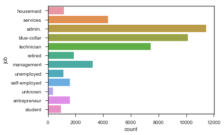


```python
data = data[data.job != 'unknown']
```


```python
sns.countplot(y='marital', data=data)
```


    <matplotlib.axes._subplots.AxesSubplot at 0x249418ae748>


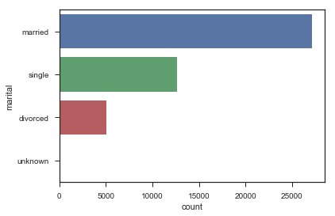


```python
data.marital.value_counts()
```


    married     27175
    single      12638
    divorced     5043
    unknown        82
    Name: marital, dtype: int64


```python
data = data[data.marital != 'unknown']
data = data[data.loan != 'unknown']
```


```python
sns.countplot(y='education', data=data)
```


    <matplotlib.axes._subplots.AxesSubplot at 0x249416613c8>


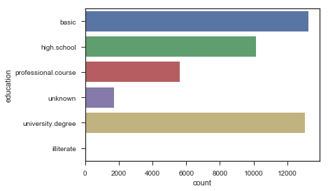


```python
data = data[data.education != 'illiterate']
```


```python
data.describe()
```


<div>

<table border="1" class="dataframe">
  <thead>
    <tr style="text-align: right;">
      <th></th>
      <th>age</th>
      <th>job</th>
      <th>marital</th>
      <th>education</th>
      <th>default</th>
      <th>housing</th>
      <th>loan</th>
      <th>contact</th>
      <th>month</th>
      <th>day_of_week</th>
      <th>...</th>
      <th>campaign</th>
      <th>pdays</th>
      <th>previous</th>
      <th>poutcome</th>
      <th>emp.var.rate</th>
      <th>cons.price.idx</th>
      <th>cons.conf.idx</th>
      <th>euribor3m</th>
      <th>nr.employed</th>
      <th>y</th>
    </tr>
  </thead>
  <tbody>
    <tr>
      <th>count</th>
      <td>43748</td>
      <td>43748</td>
      <td>43748</td>
      <td>43748</td>
      <td>43748</td>
      <td>43748</td>
      <td>43748</td>
      <td>43748</td>
      <td>43748</td>
      <td>43748</td>
      <td>...</td>
      <td>43748</td>
      <td>43748</td>
      <td>43748</td>
      <td>43748</td>
      <td>43748</td>
      <td>43748</td>
      <td>43748</td>
      <td>43748</td>
      <td>43748</td>
      <td>43748</td>
    </tr>
    <tr>
      <th>unique</th>
      <td>78</td>
      <td>11</td>
      <td>3</td>
      <td>5</td>
      <td>3</td>
      <td>2</td>
      <td>2</td>
      <td>2</td>
      <td>10</td>
      <td>5</td>
      <td>...</td>
      <td>41</td>
      <td>27</td>
      <td>8</td>
      <td>3</td>
      <td>10</td>
      <td>26</td>
      <td>26</td>
      <td>316</td>
      <td>11</td>
      <td>2</td>
    </tr>
    <tr>
      <th>top</th>
      <td>31</td>
      <td>admin.</td>
      <td>married</td>
      <td>basic</td>
      <td>no</td>
      <td>yes</td>
      <td>no</td>
      <td>cellular</td>
      <td>may</td>
      <td>thu</td>
      <td>...</td>
      <td>1</td>
      <td>999</td>
      <td>0</td>
      <td>nonexistent</td>
      <td>1.4</td>
      <td>93.994</td>
      <td>-36.4</td>
      <td>4.857</td>
      <td>5228.1</td>
      <td>no</td>
    </tr>
    <tr>
      <th>freq</th>
      <td>2079</td>
      <td>11174</td>
      <td>26508</td>
      <td>13231</td>
      <td>34778</td>
      <td>23514</td>
      <td>36912</td>
      <td>27915</td>
      <td>14595</td>
      <td>9160</td>
      <td>...</td>
      <td>18731</td>
      <td>42139</td>
      <td>37748</td>
      <td>37748</td>
      <td>17239</td>
      <td>8157</td>
      <td>8157</td>
      <td>3027</td>
      <td>17239</td>
      <td>38828</td>
    </tr>
  </tbody>
</table>
<p>4 rows × 21 columns</p>
</div>


```python
sns.countplot(y='y', data=data)
```


    <matplotlib.axes._subplots.AxesSubplot at 0x24941da6400>


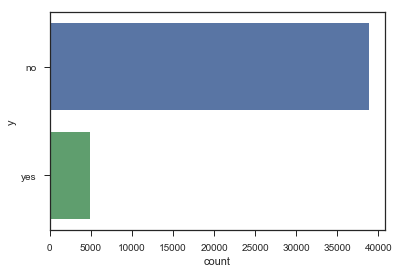


From the above Picture, We can say that the data is imbalanced


```python
data = categorize(data)
data = data.convert_objects(convert_numeric=True)
```

    C:\Users\Akhil\AnaConda\lib\site-packages\ipykernel_launcher.py:2: FutureWarning: convert_objects is deprecated.  Use the data-type specific converters pd.to_datetime, pd.to_timedelta and pd.to_numeric.
      
    

### Checking for outliers using boxplots


```python
sns.boxplot(x='y', y='duration', data=data)
```


    <matplotlib.axes._subplots.AxesSubplot at 0x24941712e80>


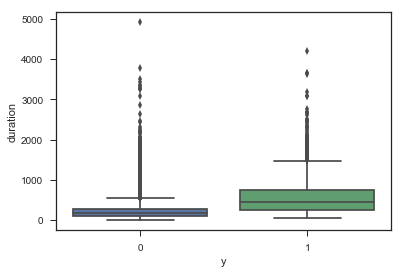


```python
sns.boxplot(x='y', y='education', data=data)
```


    <matplotlib.axes._subplots.AxesSubplot at 0x24942cae9b0>


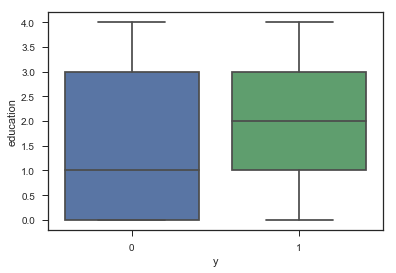


```python
sns.boxplot(x='y', y='housing', data=data)
```


    <matplotlib.axes._subplots.AxesSubplot at 0x24942be51d0>


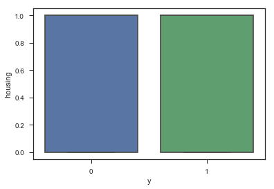


```python
sns.boxplot(data['y'],data['age'])
```


    <matplotlib.axes._subplots.AxesSubplot at 0x24941a72a58>


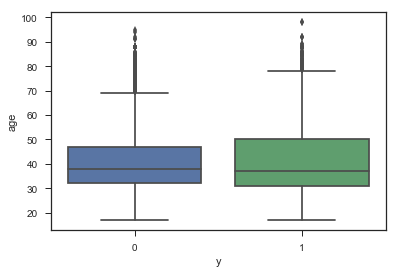


```python
sns.boxplot(data['y'],data['job'])
```


    <matplotlib.axes._subplots.AxesSubplot at 0x24942762d68>


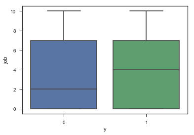


```python
sns.boxplot(data['y'],data['campaign'])

```


    <matplotlib.axes._subplots.AxesSubplot at 0x24942d7eef0>


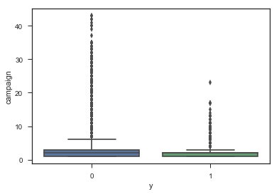


### Removing outliers


```python
def remove_outliers(df, column , minimum, maximum):
    col_values = df[column].values
    df[column] = np.where(np.logical_or(col_values<minimum, col_values>maximum), col_values.mean(), col_values)
    return df
```


```python
min_val = data["duration"].min()
max_val = 1500
data = remove_outliers(df=data, column='duration' , minimum=min_val, maximum=max_val)

min_val = data["age"].min()
max_val = 80
data = remove_outliers(df=data, column='age' , minimum=min_val, maximum=max_val)

min_val = data["campaign"].min()
max_val = 6
data = remove_outliers(df=data, column='campaign' , minimum=min_val, maximum=max_val)

```

### Dropping less meaningful columns


```python
sns.countplot(x='education',hue='y',data=data)
```


    <matplotlib.axes._subplots.AxesSubplot at 0x2494240e668>


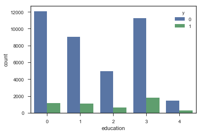


```python
sns.countplot(x='default',hue='y',data=data)
```


    <matplotlib.axes._subplots.AxesSubplot at 0x2494263b6d8>


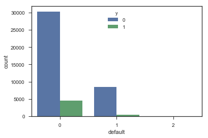


It is skewed to 0. So We can drop this.


```python
data = data.drop('default',axis=1)
```


```python
sns.countplot(x='poutcome',hue='y',data=data)
```


    <matplotlib.axes._subplots.AxesSubplot at 0x24943345d68>


So many non existent values. We can drop this


```python
data = data.drop('poutcome',axis=1)
```


```python
sns.countplot(x='loan',hue='y',data=data)
```


    <matplotlib.axes._subplots.AxesSubplot at 0x249435135f8>


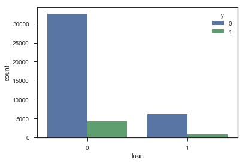


```python
sns.countplot(x='contact',hue='y',data=data)
```


    <matplotlib.axes._subplots.AxesSubplot at 0x24943074d30>


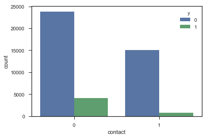


```python
data = data.drop('contact',axis=1)
```


```python
data = data.drop(['emp.var.rate','cons.price.idx','cons.conf.idx','euribor3m','nr.employed'],axis=1)
```


```python
data.info()
```

    <class 'pandas.core.frame.DataFrame'>
    Int64Index: 43748 entries, 0 to 4118
    Data columns (total 13 columns):
    age            43748 non-null float64
    job            43748 non-null int64
    marital        43748 non-null int64
    education      43748 non-null int64
    housing        43748 non-null int64
    loan           43748 non-null int64
    month          43748 non-null int64
    day_of_week    43748 non-null int64
    duration       43748 non-null float64
    campaign       43748 non-null float64
    pdays          43748 non-null int64
    previous       43748 non-null int64
    y              43748 non-null int64
    dtypes: float64(3), int64(10)
    memory usage: 5.9 MB
    


```python
data.head()
```


<div>

<table border="1" class="dataframe">
  <thead>
    <tr style="text-align: right;">
      <th></th>
      <th>age</th>
      <th>job</th>
      <th>marital</th>
      <th>education</th>
      <th>housing</th>
      <th>loan</th>
      <th>month</th>
      <th>day_of_week</th>
      <th>duration</th>
      <th>campaign</th>
      <th>pdays</th>
      <th>previous</th>
      <th>y</th>
    </tr>
  </thead>
  <tbody>
    <tr>
      <th>0</th>
      <td>56.0</td>
      <td>3</td>
      <td>1</td>
      <td>0</td>
      <td>0</td>
      <td>0</td>
      <td>6</td>
      <td>1</td>
      <td>261.0</td>
      <td>1.0</td>
      <td>999</td>
      <td>0</td>
      <td>0</td>
    </tr>
    <tr>
      <th>1</th>
      <td>57.0</td>
      <td>7</td>
      <td>1</td>
      <td>1</td>
      <td>0</td>
      <td>0</td>
      <td>6</td>
      <td>1</td>
      <td>149.0</td>
      <td>1.0</td>
      <td>999</td>
      <td>0</td>
      <td>0</td>
    </tr>
    <tr>
      <th>2</th>
      <td>37.0</td>
      <td>7</td>
      <td>1</td>
      <td>1</td>
      <td>1</td>
      <td>0</td>
      <td>6</td>
      <td>1</td>
      <td>226.0</td>
      <td>1.0</td>
      <td>999</td>
      <td>0</td>
      <td>0</td>
    </tr>
    <tr>
      <th>3</th>
      <td>40.0</td>
      <td>0</td>
      <td>1</td>
      <td>0</td>
      <td>0</td>
      <td>0</td>
      <td>6</td>
      <td>1</td>
      <td>151.0</td>
      <td>1.0</td>
      <td>999</td>
      <td>0</td>
      <td>0</td>
    </tr>
    <tr>
      <th>4</th>
      <td>56.0</td>
      <td>7</td>
      <td>1</td>
      <td>1</td>
      <td>0</td>
      <td>1</td>
      <td>6</td>
      <td>1</td>
      <td>307.0</td>
      <td>1.0</td>
      <td>999</td>
      <td>0</td>
      <td>0</td>
    </tr>
  </tbody>
</table>
</div>


### Splitting into train and test data


```python
X = data.drop('y',axis = 1).values
y = data['y'].values
X_train, X_test, Y_train, Y_test = train_test_split(X, y, test_size=0.25, random_state=42)
```


```python
scaler = StandardScaler()
scaler.fit(X_train)
X_train = scaler.fit_transform(X_train)
```


```python
pca = PCA(n_components=10)
pca.fit(X_train)
X_train = pca.fit_transform(X_train)
```


```python
X_train.shape
```


    (32811, 10)


### Building different Models and validating using 10 fold cross validation


```python
models = []
models.append(('LR', LogisticRegression()))
models.append(('LDA', LinearDiscriminantAnalysis()))
models.append(('KNN', KNeighborsClassifier()))
models.append(('Decison-Tree', DecisionTreeClassifier()))
models.append(('Gaussian', GaussianNB()))
models.append(('SVM', SVC()))
models.append(('RandForest',RandomForestClassifier(max_depth = 8, n_estimators = 120)))
models.append(('ADA', AdaBoostClassifier(n_estimators = 120)))
```


```python
results = []
names = []
for name, model in models:
    kfold = model_selection.KFold(n_splits=10, random_state=42)
    cv_results = model_selection.cross_val_score(model, X_train, Y_train, cv=kfold, scoring='accuracy')
    results.append(cv_results)
    names.append(name)
    msg = "{}: {}".format(name, cv_results.mean())
    print(msg)
```

    LR: 0.9035995662058859
    LDA: 0.8985707323442396
    KNN: 0.8959804395183542
    Decison-Tree: 0.8750726255966388
    Gaussian: 0.897686836904297
    SVM: 0.9020756591465906
    RandForest: 0.9044224674742637
    ADA: 0.8990278171682992
    

## Logistic Regression obtained the highest accuracy with lesser runtime and is more stable in the results. Even SVM and Random Forest obtained the similar accuracy but have higher runtime compared to Logistic Regession.


```python
sns.set(rc={'figure.figsize':(10,8)})
sns.boxplot(names,results)
```


    <matplotlib.axes._subplots.AxesSubplot at 0x24942ee4940>


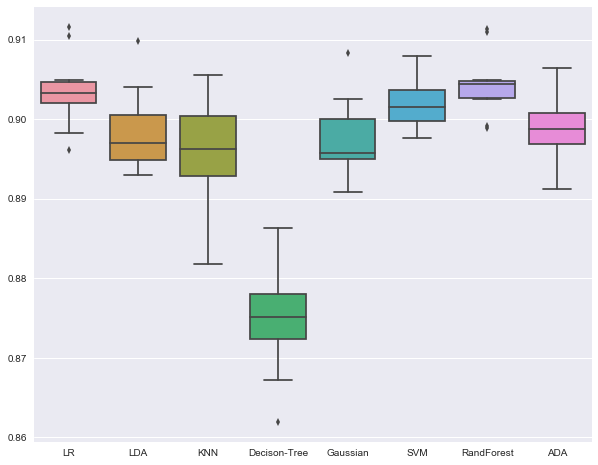


### Testing with the test data


```python
scaler.fit(X_test)
X_test = scaler.fit_transform(X_test)
```


```python
pca.fit(X_test)
X_test = pca.fit_transform(X_test)
```


```python
lr = LogisticRegression()
lr.fit(X_train, Y_train)
predictions = lr.predict(X_test)
print("Accuracy : ", accuracy_score(Y_test, predictions))
print("Confusion Matrix : \n",confusion_matrix(Y_test, predictions))
print("Classification Report: \n",classification_report(Y_test, predictions))
```

    Accuracy :  0.901252628692
    Confusion Matrix : 
     [[9611  126]
     [ 954  246]]
    Classification Report: 
                  precision    recall  f1-score   support
    
              0       0.91      0.99      0.95      9737
              1       0.66      0.20      0.31      1200
    
    avg / total       0.88      0.90      0.88     10937
    
    
